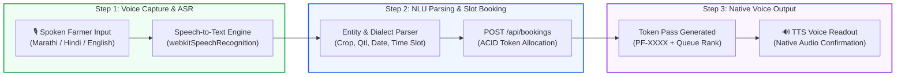
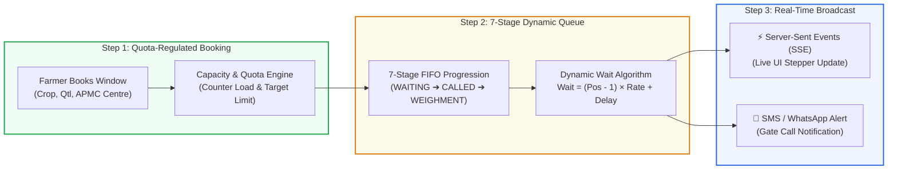
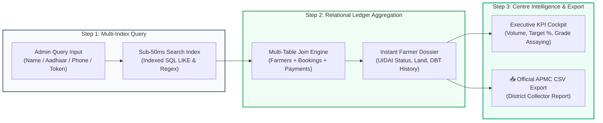
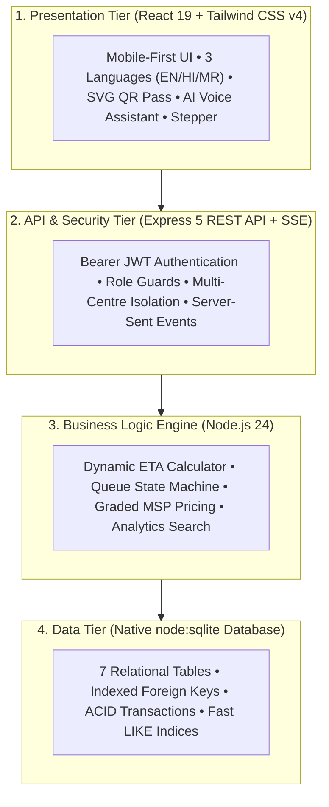

# 🌾 ProcureFlow — Smart Digital Agricultural Procurement & Dynamic Queue Management System

[](https://nodejs.org/)
[](https://react.dev/)
[](https://vitejs.dev/)
[](https://tailwindcss.com/)
[](https://nodejs.org/api/sqlite.html)
[](LICENSE)

> **Smart India Hackathon (SIH) Solution**  
> An end-to-end, resilient GovTech platform designed to eliminate multi-hour farmer queues, ensure transparent Minimum Support Price (MSP) quality bonuses, and automate Direct Benefit Transfer (DBT) payouts across Agricultural Produce Market Committees (APMCs).

---

## 📋 Table of Contents
1. [The Problem & Expected Solution](#-the-problem--expected-solution)
2. [Key Features & Innovations](#-key-features--innovations)
3. [Technical Workings & Flowcharts](#-technical-workings--flowcharts)
4. [User Flow & System Architecture](#-user-flow--system-architecture)
5. [Evaluation & Demo Credentials](#-evaluation--demo-credentials)
6. [Quick Start & Setup Guide](#-quick-start--setup-guide)
7. [Repository Structure](#-repository-structure)
8. [Automated Rehearsal & Verification (44 Tests)](#-automated-rehearsal--verification-44-tests)

---

## 🎯 The Problem & Expected Solution

### Problem Statement:
Traditional APMC mandis suffer from uncoordinated farmer arrivals resulting in 8–14 hour physical queues, extreme traffic congestion, price exploitation by middlemen, lack of moisture testing transparency, and delayed payment confirmations.

### Expected Solution Fulfillments:
- ✅ **Multilingual AI Voice Assistant**: 2-way conversational voice booking in **Marathi (मराठी)**, **Hindi (हिंदी)**, and **English** for hands-free, zero-friction access.
- ✅ **Dynamic Queue Management**: Transparent 7-stage FIFO state machine with explainable wait-time calculations and Server-Sent Events (SSE) live push sync.
- ✅ **Instant Farmer Dossier & Aadhaar Lookup**: Sub-50ms search by Farmer Name, 12-digit Aadhaar Number, Phone, PM-Kisan ID, or Token number.
- ✅ **Executive APMC Centre Analytics**: Real-time capacity utilization tracking, quality grade distributions, and 1-click APMC CSV export.
- ✅ **Anti-Corruption Graded MSP & DBT**: Server-computed quality bonuses (+5% for Grade A) and direct PFMS bank account disbursement.

---

## 🌟 Key Features & Innovations

### 1. 🎙️ 2-Way Multilingual AI Voice Assistant
- Hands-free slot booking supporting spoken dialects in **Marathi**, **Hindi**, and **English**.
- Real-time Speech-to-Text (`webkitSpeechRecognition`), NLU entity parser (extracts crop, quantity in quintals, date, and slot window), and native Text-to-Speech (`speechSynthesis`) confirmation.

### 2. 🔍 Executive Analytics & Instant Farmer Dossier Lookup
- High-speed indexed search for APMC centre administrators.
- Type any **Farmer Name**, **Aadhaar Number** (`XXXX-XXXX-XXXX` or last 4 digits), **Mobile**, **PM-Kisan ID**, or **Token #** to pull:
  - UIDAI Verified Aadhaar status & Satbara 7/12 Land Holdings.
  - Linked Direct Benefit Transfer (DBT) Bank Account & IFSC.
  - Lifetime Procurement Summary (Total Qtl sold, Gross MSP earnings, Paid vs Pending DBT).
  - Complete historical transaction ledger with **Print / View Pass & Receipt** triggers.

### 3. 🎫 Digital APMC Gate Pass with Scannable QR Matrix
- Generates procedural SVG QR Code tokens (`PF-1024+`) for optical scanning at APMC entry gates.
- Printable gate pass slip with farmer details, crop type, quantity, slot timing, and mandi directions.

### 4. ⏱️ 7-Stage Visual Progression Pipeline
- Real-time stepper tracking:  
  $$\text{Booked} \longrightarrow \text{Waiting in Queue} \longrightarrow \text{Called to Counter} \longrightarrow \text{Checked In} \longrightarrow \text{Quality Assay} \longrightarrow \text{Weighment} \longrightarrow \text{Confirmed / Paid}$$

### 5. 🧮 Deterministic & Explainable Wait-Time Formula
- Real-time queue math engine calculated dynamically:
  $$\text{Estimated Wait (min)} = \left(\frac{\text{Farmers Ahead} \times \text{Avg Processing Time}}{\text{Active Counters}}\right) + \text{Delay}$$

### 6. 🔬 Anti-Corruption Graded MSP Pricing Engine
- Server-side atomic pricing calculator factoring in quality benchmarks:
  - **Grade A**: $+5\%$ Quality Bonus above MSP
  - **FAQ Standard**: $100\%$ Base MSP
  - **Grade B**: $-5\%$ Deduction
  - **Below FAQ**: $-10\%$ Deduction
  - Moisture tolerance validation ($<12\%$) and automatic net payable calculation.

---

## 🔄 Technical Workings & Flowcharts

### 1. Multilingual AI Voice Assistant Flowchart



### 2. Real-Time Dynamic Queue Management Flowchart



### 3. Executive Analytical Dashboard & Instant Dossier Flowchart



---

## 🏗️ 4-Tier System Architecture



---

## 🔑 Evaluation & Demo Credentials

| Role | Access URL | Credentials | Context / Test Scope |
|---|---|---|---|
| **Farmer (Demo)** | [http://localhost:5173/farmer/login](http://localhost:5173/farmer/login) | **Phone:** `9999990001`<br>**Password:** `farmer123`<br>*(Or OTP `4829`)* | *Ramesh Patil* (Starts clean to test slot booking, voice assistant, and pass printing) |
| **Centre Officer (Pune)** | [http://localhost:5173/admin/login](http://localhost:5173/admin/login) | **Code:** `ADMIN001`<br>**Password:** `admin123` | *Suresh Kale* (Controls Pune APMC queue, assaying, farmer dossier search, and DBT payouts) |
| **Centre Officer (Nashik)** | [http://localhost:5173/admin/login](http://localhost:5173/admin/login) | **Code:** `ADMIN002`<br>**Password:** `admin123` | *Vaishali Deshmukh* (Demonstrates multi-centre security isolation) |

---

## ⚡ Quick Start & Setup Guide

### Prerequisites:
- Node.js 22+ or Node.js 24 (with native `node:sqlite` support)
- npm 10+

### 1. Install Dependencies
```bash
# Backend dependencies
cd backend
npm install

# Frontend dependencies
cd ../frontend
npm install
```

### 2. Seed Demo Database
```bash
cd backend
node db/seed.js
```

### 3. Run Development Servers
Open two terminal windows:

**Terminal 1 (Backend - Port 4000):**
```bash
cd backend
node server.js
```

**Terminal 2 (Frontend - Port 5173):**
```bash
cd frontend
npm run dev
```

Visit **[http://localhost:5173](http://localhost:5173)** in your browser.

---

## 📁 Repository Structure

```
ProcureFlow/
├── backend/
│   ├── config/constants.js        # Crops, MSP rates, grade factors, slot windows, statuses
│   ├── data/procureflow.db        # SQLite database file
│   ├── db/
│   │   ├── index.js               # Database connection using native node:sqlite
│   │   ├── schema.js              # 7-table schema with indexes and virtual columns
│   │   └── seed.js                # Database seeder for demo state
│   ├── middleware/auth.js         # Bearer token verification & role enforcement
│   ├── routes/
│   │   ├── analytics.js           # Centre KPI metrics, instant farmer lookup, and CSV export
│   │   ├── auth.js                # Farmer & Admin authentication + OTP
│   │   ├── bookings.js            # Slot reservation, multi-slot support, and receipts
│   │   ├── centres.js             # APMC centre capacities and slots
│   │   ├── notifications.js       # Live notifications and SSE event stream
│   │   ├── payments.js            # DBT disbursement and PFMS UTR generation
│   │   └── queue.js               # 7-stage queue state machine and caller
│   ├── services/                  # Business logic (booking, ETA, queue, procurement, payments)
│   ├── demo-check.js              # 44-step automated rehearsal test suite
│   └── server.js                  # Main Express entrypoint (Port 4000)
│
├── frontend/
│   ├── src/
│   │   ├── auth/AuthContext.jsx   # Authentication context, OTP & Google login
│   │   ├── components/            # UI components (AdminAnalytics, VoiceAssistant, Stepper, Pass)
│   │   ├── hooks/                 # React hooks (usePoll, useLiveEvents)
│   │   ├── i18n/                  # 3-language dictionaries (EN, HI, MR) & LanguageContext
│   │   ├── layouts/               # Shell and responsive navigation layouts
│   │   ├── pages/                 # Landing, Farmer Dashboard, Admin Cockpit, Slot Booking
│   │   ├── services/api.js        # Central fetch client with Vite proxy integration
│   │   ├── App.jsx                # Application routes
│   │   └── main.jsx               # React entry point
│   ├── vite.config.js             # Vite 8 configuration with proxy forwarding
│   └── package.json               # React 19, Tailwind v4, Lucide dependencies
│
└── README.md                      # Master project README
```

---

## 🧪 Automated Rehearsal & Verification (44 Tests)

The project includes an automated end-to-end rehearsal script that verifies all 44 lifecycle steps:

```bash
cd backend
node demo-check.js
```

**Expected Result:**
```
==============================================
44 ok, 0 failed
==============================================
```

---

*Developed for Smart India Hackathon (SIH)*
