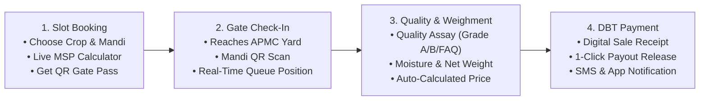
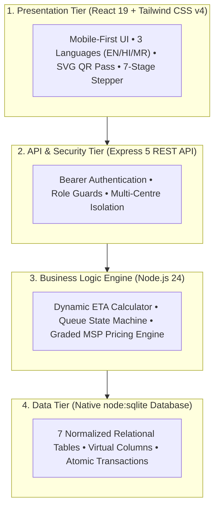

# 🌾 ProcureFlow — Smart Digital Agricultural Procurement & Queue Platform

[](https://nodejs.org/)
[](https://react.dev/)
[](https://vitejs.dev/)
[](https://tailwindcss.com/)
[](https://nodejs.org/api/sqlite.html)
[](LICENSE)

> **Smart India Hackathon (SIH) Solution**  
> An end-to-end, resilient GovTech platform designed to eliminate multi-hour farmer queues, ensure transparent Minimum Support Price (MSP) quality bonuses, and automate Direct Benefit Transfer (DBT) payouts across Agricultural Produce Market Committees (APMCs).

---

## 📋 Table of Contents
1. [The Problem & Expected Solution](#-the-problem--expected-solution)
2. [Key Features & Innovations](#-key-features--innovations)
3. [User Flow & System Architecture](#-user-flow--system-architecture)
4. [Strategic Improvements & Future Roadmap](#-strategic-improvements--future-roadmap)
5. [Evaluation Credentials](#-evaluation-credentials)
6. [Quick Start & Setup Guide](#-quick-start--setup-guide)
7. [Repository Structure](#-repository-structure)
8. [Automated Rehearsal & Verification](#-automated-rehearsal--verification)

---

## 🎯 The Problem & Expected Solution

### Problem Statement:
Traditional APMC mandis suffer from uncoordinated farmer arrivals resulting in 8–14 hour physical queues, extreme traffic congestion, price exploitation by middlemen, and delayed payment confirmations.

### Expected Solution Fulfillments:
- ✅ **Farmer Registration & Slot Booking**: Icon-led, mobile-friendly interface supporting local regional languages with guaranteed time-window reservations.
- ✅ **Real-Time Queue Management**: Transparent 7-stage queue state machine with explainable wait-time calculations.
- ✅ **SMS & In-App Notifications**: Real-time actionable alerts, counter call-ups, and SMS gateway simulation for feature phones.
- ✅ **Procurement & Payment Tracking**: Server-computed MSP with quality grade bonuses (+5% for Grade A) and DBT payment status tracking.
- ✅ **Mandi Decongestion & Advised Arrival**: Dynamic *"Reach By"* arrival engine that eliminates yard overcrowding before the farmer leaves home.

---

## 🌟 Key Features & Innovations

### 1. 🎫 Digital APMC Gate Pass with Scannable QR Matrix
- Generates procedural SVG QR Code tokens (`PF-1024+`) for instant optical scanning at APMC entry gates.
- Printable gate pass slip with farmer details, crop type, quantity, and slot timing.

### 2. ⏱️ 7-Stage Visual Progression Pipeline
- Interactive stepper tracking:  
  $$\text{Booked} \longrightarrow \text{Waiting in Queue} \longrightarrow \text{Called to Counter} \longrightarrow \text{Checked In} \longrightarrow \text{Quality Assay} \longrightarrow \text{Weighment} \longrightarrow \text{Confirmed / Paid}$$

### 3. 🧮 Deterministic & Explainable Wait-Time Formula
- Real-time queue math engine calculated dynamically:
  $$\text{Estimated Wait (min)} = \left(\frac{\text{Farmers Ahead} \times \text{Avg Processing Time}}{\text{Active Counters}}\right) + \text{Delay}$$

### 4. 🔬 Anti-Corruption Graded MSP Pricing Engine
- Server-side atomic pricing calculator factoring in quality benchmarks:
  - **Grade A**: $+5\%$ Quality Bonus above MSP
  - **FAQ Standard**: $100\%$ Base MSP
  - **Grade B**: $-5\%$ Deduction
  - **Below FAQ**: $-10\%$ Deduction
  - Moisture tolerance validation ($<12\%$) and automatic net payable calculation.

### 5. 🌐 3-Language Localization (i18n)
- Native support for **English**, **Hindi (हिंदी)**, and **Marathi (मराठी)**.

### 6. ⛅ Smart Agri Advisory & Helpline
- Live district weather forecast and harvesting conditions check.
- Mandi live rates benchmark comparison (APMC vs. private traders).
- Multilingual speech synthesis Voice Guidance Assistant.
- Integrated 24x7 Kisan Call Centre helpline (`1800-180-1551`).

---

## 🔄 User Flow & System Architecture

### 📊 End-to-End User Flow



### 🏗️ 4-Tier System Architecture



---

## 🚀 Strategic Improvements & Future Roadmap

### Solution to Improve-
1. Build stable lightweight application.
2. Scalable backend infrastructure.
3. Simple authentication (Google & Mobile OTP).
4. Multilingual instructor, visual guidance.
5. Add file validation, compression msgs.
6. Improve location/centre selection.
7. SMS confirmation with booking ID.
8. Ticket tracking, FAQs, support system.
9. Provide real-time approval tracking.
10. Use very simple UI, multi-lingual, voice assistant.

### Can Improve in Our App-
1. Huge Product catalogue.
2. Expert advice.
3. Crop diagnosis.
4. Weather.
5. Farmer Community.
6. Multilingual from start.
7. Offline Working (PWA).
8. Customer support.
9. Voice-Based Assistant.
10. Mandi Comparison.
11. Automatic reminders.

---

## 🔑 Evaluation Credentials

| Role | Access URL | Credentials | Purpose / Context |
|---|---|---|---|
| **Farmer (Demo)** | [http://localhost:5173/farmer/login](http://localhost:5173/farmer/login) | **Phone:** `9999990001`<br>**Password:** `farmer123`<br>*(Or Mobile OTP with code `4829`)* | *Ramesh Patil* (Starts with a clean slate to demonstrate slot booking flow) |
| **Centre Officer (Pune)** | [http://localhost:5173/admin/login](http://localhost:5173/admin/login) | **Code:** `ADMIN001`<br>**Password:** `admin123` | *Suresh Kale* (Controls Pune APMC queue, QR scanner, and payouts) |
| **Centre Officer (Nashik)** | [http://localhost:5173/admin/login](http://localhost:5173/admin/login) | **Code:** `ADMIN002`<br>**Password:** `admin123` | *Vaishali Deshmukh* (Demonstrates multi-centre security isolation) |

---

## ⚡ Quick Start & Setup Guide

### Prerequisites:
- Node.js 22+ or Node.js 24 (with native `node:sqlite` support)
- npm 10+

### 1. Clone & Install Dependencies
```bash
# Backend dependencies
cd backend
npm install

# Frontend dependencies
cd ../frontend
npm install
```

### 2. Seed Demo Database
```bash
cd backend
node db/seed.js
```

### 3. Run Development Servers
Open two terminal windows:

**Terminal 1 (Backend - Port 4000):**
```bash
cd backend
node server.js
```

**Terminal 2 (Frontend - Port 5173):**
```bash
cd frontend
npm run dev
```

Visit **[http://localhost:5173](http://localhost:5173)** in your browser.

---

## 📁 Repository Structure

```
ProcureFlow/
├── backend/
│   ├── config/constants.js        # Crops, MSP rates, grade factors, slot windows, statuses
│   ├── data/procureflow.db        # SQLite database file
│   ├── db/
│   │   ├── index.js               # Database connection using native node:sqlite
│   │   ├── schema.js              # 7-table schema with indexes and virtual columns
│   │   └── seed.js                # Database seeder for demo state
│   ├── middleware/auth.js         # Bearer token verification & role enforcement
│   ├── routes/                    # Express route controllers (auth, bookings, queue, etc.)
│   ├── services/                  # Business logic (booking, ETA, queue, procurement, payments)
│   ├── utils/                     # Formatting helpers (dates, money, http)
│   ├── demo-check.js              # 42-step automated rehearsal test suite
│   └── server.js                  # Main Express entrypoint (Port 4000)
│
├── frontend/
│   ├── src/
│   │   ├── auth/AuthContext.jsx   # Authentication context, OTP & Google login
│   │   ├── components/            # UI components (Alerts, Badges, QR Code, Stepper, Advisory)
│   │   ├── hooks/usePoll.js       # Background HTTP polling hook (4-6s interval)
│   │   ├── i18n/                  # Localization engine & dictionaries (EN, HI, MR)
│   │   ├── layouts/               # Shell and centered responsive layouts
│   │   ├── pages/                 # Landing, Farmer, Admin, and Booking pages
│   │   ├── services/api.js        # Central fetch client with Vite proxy integration
│   │   ├── App.jsx                # Application routes
│   │   └── main.jsx               # React entry point
│   ├── vite.config.js             # Vite 8 config with proxy forwarding /api -> :4000
│   └── package.json               # React 19, Tailwind v4, Lucide dependencies
│
├── SIH-PPT-CONTENT.md             # Hackathon presentation content and slide notes
├── report.md                      # Comprehensive project progress report
└── README.md                      # Master project README
```

---

## 🧪 Automated Rehearsal & Verification

The project includes an automated end-to-end rehearsal script that tests all 42 lifecycle steps (from farmer registration, slot booking, ETA calculation, QR scan check-in, quality assay calculation, to DBT payment release):

```bash
cd backend
node demo-check.js
```

**Expected Result:**
```
==============================================
42 ok, 0 failed
==============================================
```

---

*Developed for Smart India Hackathon (SIH) • Ministry of Agriculture & Farmers Welfare Compliant*
